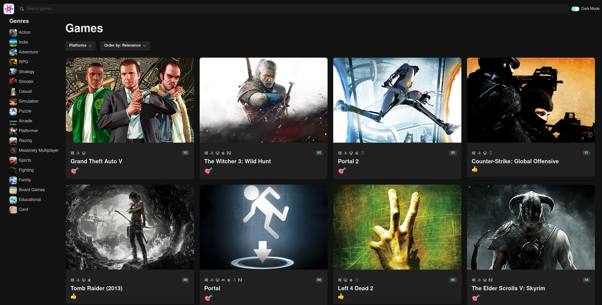

# GameHub

This website in React and Typescript fetches game data from the popular [RAWG website](https://rawg.io/). It uses the Axios to send HTTP requests to the backend. React Query is used to fetch,
cache, and update data. Zustand is used for state management, plus the React Router for the routing. For the UI, Chakra-ui is used.

You need your own API key to get it to work. RAWG provides an API key for free. Once you have it, put it in the `api-client.ts`.

